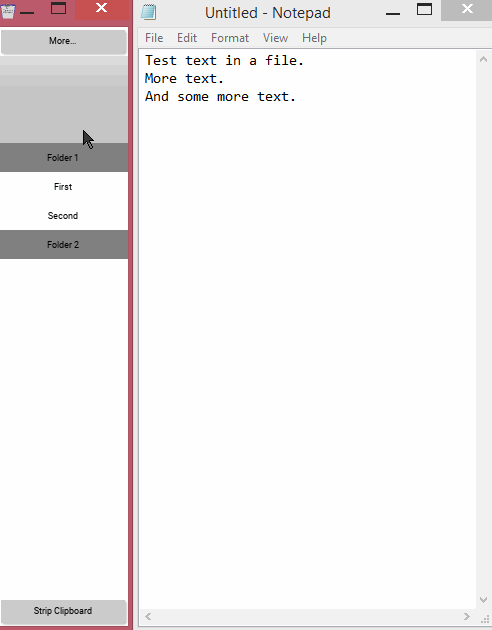
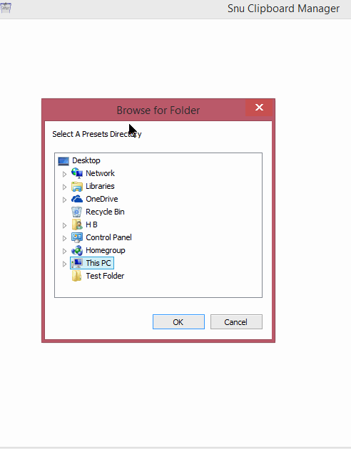

# Snu Clipboard Manager  
This program is designed to make it easy to manage your clipboard history and create and use presets.  Use this to make data entry situations easier, or to organize your code snippets.  

**Note:** this program is only built for Windows currently.  It should run on other operating systems, but some features such as always-on-top or system tray functions will not work.  
Building this program or using the python files will require Python 3 (built and tested on 3.7), and [Kivy](https://github.com/kivy/kivy) (at least version 1.11).  
This program also uses (and includes) the following libraries: [Snu Kivy Template](https://github.com/snuq/SnuKivyTemplate), [Kivy On Top](https://github.com/JakubBlaha/KivyOnTop) and [infini.systray](https://github.com/Infinidat/infi.systray)  
This program is released under the GNU General Public License.  
  

#### Basic Functionality  
Clipboard history will be kept in a list, allowing easy access to any number of previous clipboards.

Clipboard presets can be created and easily recalled into the current clipboard.  Presets can be organized into folders, and multiple presets directories can be added and switched between quickly.  

Presets are stored as text files in a folder of your choosing, allowing for easy external editing or backing-up.  

#### Quick Start  
  
When first starting Snu Clipboard Manager, you will need to set a presets folder.  All created presets and preset categories will be created inside this folder.  
Click on the 'Add Presets Folder' button and select an existing folder in the file browser window.  

You can now click on the 'Edit Presets' button above and get started adding new folders and presets by clicking on the Green add buttons in the list on the left.  

To add presets, first at least one folder must be added, click the green 'Add Section' button in the list on the left, and enter a name for your folder.  
You may now Click on the green 'Add Item' button below to create new presets.  

&nbsp;  

## Main Interface  
The main window has two modes: Shrunk and expanded.  
Clicking the 'More...' button at the top of the window will toggle this mode.  

Below this is shown a snippet of the current clipboard, and a set number of clipboard history items if the "History In Main Window" setting is set above 1.  
Clicking on a history element will set that to the current clipboard.  

Below this is shown the clipboard presets.  
Presets are organized into folders.  The folders can be expanded or contracted by clicking on the folder title, this will hide all presets in that folder.  
Clicking on a preset will set that preset's content to the current clipboard.  

At the bottom of this window will be buttons that can modify the current clipboard in various ways, these buttons can be enabled or disabled in the program settings.  

&nbsp;  

## Expanded Interface  
When in expanded mode, additional buttons across the top are shown, these act as tabs to display different interface elements.  

#### History  
This Tab will show an extended view of all clipboard history.  Click on the red 'X' button next to a history element to delete it.  Click on the 'Clear' button to remove all clipboard history, except for the current clipboard.  

The bottom half of the History tab will show an extended clipboard editor, all text edits in this will automatically update the current clipboard.  

#### Edit Presets  
Entering this tab will change the presets view on the left.  
Note that while in this tab, the window will not automatically shrink when the mouse leaves, even if this setting is enabled.  

To add presets, first at least one folder must be added.  Click the 'Add Section' button at the top of the presets list to add a new folder.  
Once a folder has been added, you may add presets under it by clicking on the green 'Add Item' button below each folder.  

Adding a preset will prompt for a name, then set that preset as the current editing preset on the right side.  
Edit the title or content of the preset, and click the 'Save' button to make your changes permanent.  

Presets and preset folders can be deleted by clicking the red 'X' button next to them in the list on the left.  Deleting a preset will permanently delete the text file from your computer.  Deleting a folder will permanently delete all contained presets from your computer.  

The 'Open Preset Folder' button on the right side will open the current preset folder in your system's file browser, allowing you to make changes to the contained files with a text editor of your choice.  
When you make changes to the files, be sure to click the 'Reload Presets' button to ensure that the presets are all updated in Snu Clipboard Manager.  

#### Select Presets  
This tab will allow selecting and editing of the preset folders.  

You can see the current preset folder at the top of this window, click on a preset folder button below to change the current preset and update the list to the left.  

Click on the 'Add Presets Folder' button and select an existing folder in the file browser window.  

Click the red 'X' button next to a preset folder to remove it from the list.  Note that the folder itself or the presets stored in it will not be changed or removed by this action!  

&nbsp;  

## Settings  
The settings screen can be accessed by pressing F1 or by clicking the 'hamburger' button in the expandd window.

#### Basic Behavior  
**Max Clipboard History**  
Number of clipboard history elements to store and display in the expanded window.  

**Auto-Shrink Window**
When the mouse leaves the window and remains out for 1 second, the window will revert to its shrunk size if it is currently expanded.  

**Auto-Expand Window**  
When the mouse enters the window, it will be switched into expanded mode automatically.

**Minimize On Startup**  
Sets the window to minimized when Snu Clipboard Manager is started.  

**Always-On-Top**  
Note: Only available on Windows currently.
If enabled, the main window will be set to always-on-top mode when started.  

**Show Tray Icon**  
Note: Only available on Windows currently.  
A tray icon is shown that will allow provide access to Snu Clipboard Manager.  

**Minimize To Tray**  
Note: Only available on Windows currently.  
When the window is minimized, it will be hidden and can only be restored from the tray icon. Will only function if the tray icon is enabled.  

**Disallow Duplicates**
Prevent duplicate entries from being kept in the clipboard history.  As soon as a new clipboard is saved, previous exact copies of the same text will be removed.  

#### Main Window Appearance  
**Show Undo Clipboard Button**  
Add a button to the main window that will reverse the last clipboard action.

**Show Strip Clipboard Button**  
Add a button to the main window that will remove all formatting and surrounding spaces from the current clipboard.

**History In Main Window**  
Number of history elements to display at the top of the main window.  This cannot be set above the max history, and setting it too high will block the presets area.  

#### Interface Scaling  
**Shrunk Width Scale**  
A percentage value to control the target width of the shrunk window.  Setting this higher will result in a wider window, and lower will result in a smaller window.  Note that the window has a minimum width enforced by the operating system.  

**Expanded Width Scale**  
A percentage value to control the target width of the expanded window.  Changing this will not affect the shrunk window size.  

**Button Scale**  
Controls the height of buttons and text elements in the interface, acts as an overall scaling value.  

**Text Scale**  
Extra scale to control the size of text inside other elements.  This should not normally be changed, as changing the Button Scale will also change overall text size.  

&nbsp;  

## Shortcuts  
This program has a number of keyboard shortcuts to make quick usage easier.

* Ctrl-Mouse Click - On a folder, will open the 'quick add' dialog to add the current clipboard as a new preset within that folder.  On a preset, will enter edit mode for that preset.  
* Shift-Mouse Click - On a folder, this will expand that folder and minimize all others.
* F1 - Opens the program settings panel.
* F2 - This will toggle-expand the window, and show the 'History' tab.
* F3 - This will toggle-expand the window, and show the 'Edit Presets' tab.
* F4 - This will toggle-expand the window, and show the 'Select Presets' tab.
* ` (Backtick/Tilde) - Toggles the window in/out of expanded mode.
* Alt-M - Minimize the window.
* Alt-A - Toggle always-on-top mode for the window.
